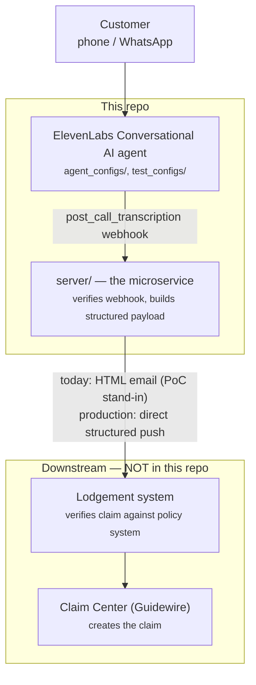

# CGU Claims Lodgement — Proof of Concept

An ElevenLabs Conversational AI voice/text agent that lets a customer lodge
a **First Notice of Loss (FNOL)** insurance claim by phone or WhatsApp,
without waiting in a human queue. ElevenLabs was chosen due to its simplicity
integrating with WhatsApp phone numbers.

**Status: proof of concept / evaluation artifact.** This is not a production
system, and it doesn't reach production systems on its own — it stops at
emailing a structured claim summary to a human inbox. See
[Scope of this repo](#scope-of-this-repo) below, and
[ADR 0004](docs/adr/0004-elevenlabs-platform-evaluation-for-fnol.md) for the
formal evaluation of whether this architecture is viable beyond a PoC.

Lastly, the agent determines whether the interaction is complete we have
no method to enforce guardrails. For production, we need to implement 
state management for the agent. For inspiration, refer to GCP GXAS Phone
Agent's Slot Filling Pattern.

## What this demonstrates

A caller (or WhatsApp user) talks to an AI agent — **Amanda**, the Claims
Lodgement Officer — who:

1. Greets the customer and asks whether they want to lodge a new claim
2. Determines the claim type: **vehicle** (by registration) or **property**
   (by address)
3. Collects the required claim fields, either by asking one at a time
   (**guided flow**) or by parsing everything the customer volunteers up
   front (**express lodgement**)
4. Confirms the customer's name spelling (voice calls only — typed WhatsApp
   text is already exact)
5. Handles edge cases: emergencies (redirects to 000), wrong numbers,
   non-claims enquiries, small talk, unresponsive callers, WhatsApp session
   timeouts
6. Once every required field is present in the conversation,
   delivers a fixed closing line and ends the call — it never says the claim
   was "lodged," never gives out a claim number, and never promises an email
   itself, because none of that happens in this repo (see below)
7. After the call/chat ends, the microservice in this repo (`server/`)
   receives ElevenLabs' post-call webhook, verifies it, turns it into a
   structured payload, and — today — emails that structured summary plus
   the transcript to a human inbox, standing in for pushing it into the
   real lodgement system (see next section)

## Scope of this repo — where the real system takes over

**This repo covers the "front door" and the microservice that gets data
out of ElevenLabs — nothing past that.** `server/` *is* the microservice:
it receives the ElevenLabs webhook and turns it into a structured payload.
Today that payload is delivered as an HTML email, as a PoC stand-in for
actually pushing it into the company's lodgement system. Everything
downstream of that push is real, exists elsewhere, and isn't documented in
any other file here — it's captured only in this README as context for
anyone picking this repo up:



## Repo layout

| Path | What it is |
|---|---|
| `agent_configs/Claims-Lodgement-Officer.json` | The shipped ElevenLabs agent config — prompt, tools, guardrails, evaluation criteria, attached tests |
| `test_configs/*.json` | 25 conversational test cases (`llm` and `simulation` types) covering flows, edge cases, and channel-specific behavior |
| `tests.json` / `agents.json` | Registries mapping local test/agent configs to their live ElevenLabs IDs |
| `server/` | FastAPI microservice: verifies the ElevenLabs post-call webhook (HMAC) and emails a structured claim summary via Resend. Deployed to Coolify |
| `scripts/` | Validation (`validate-configs.py`), live-state verification (`verify-live-tools.py`), CI test runners, Coolify deploy/verify |
| `docs/adr/` | Architectural Decision Records — chronological history of *why* the system looks the way it does (single agent vs. two agents, webhook/email design, CI/CD design, etc.) |
| `docs/prd/001-claims-lodgement-agent.md` | Original product requirements |
| `docs/agents/claims-lodgement.tdd.md` | Living technical design doc for the agent — architecture, tools, routing, guardrails, and a coverage map from PRD stories to tests. Most detailed and most current source for how the agent behaves |
| `docs/claims-lodgement-handover.md` | Full project handover — the single best "catch me up" document; covers every guardrail, incident, and open question in depth |
| `docs/server-coolify-deployment.md` | Deployment runbook for `server/` |
| `CONTEXT.md` | Domain glossary — precise definitions of terms like Claim, Claimant, Risk Asset, Closing Message, etc. |
| `CLAUDE.md` | Operating guidance for AI coding agents working in this repo (tooling, CI, sync-field gotchas, debugging methodology) |

For a deep dive, read in this order: `CONTEXT.md` (vocabulary) →
`docs/prd/001-claims-lodgement-agent.md` (what was asked for) →
`docs/adr/` in order (how the design got here) →
`docs/agents/claims-lodgement.tdd.md` (current behavior in detail) →
`docs/claims-lodgement-handover.md` (everything tied together, plus
incidents and open questions).

## Architecture at a glance

**One agent, one tool.** Earlier designs used two agents (an Officer plus a
Supervisor for a second completeness check) connected by a hand-off; both
were retired in favor of a single agent that owns the whole interaction,
backed by a platform guardrail as the mechanical safety net
([ADR 0005](docs/adr/0005-retire-claims-supervisor-single-agent-lodgement.md)).
The only tool the agent has is `end_call` — there is no tool that pushes
claim data anywhere mid-conversation. All claim data leaves the platform
exactly once, via the post-call transcript webhook, after the conversation
ends.

This remains **fundamentally flawed**. Without state and deterministic guardrails
for the agent, we cannot assure ourselves the agent acts correctly during 
complex calls/interactions. 

Because the LLM's context window is the only state the platform gives you
(no server-side state, no forced verbatim responses, no deterministic tool
firing), correctness relies on layered defenses rather than any single
mechanism: the agent's own completeness self-check, plus a blocking
platform guardrail that force-retries any response which tries to close a
claim while a required field is verifiably missing from the transcript.
Full detail in
[docs/agents/claims-lodgement.tdd.md](docs/agents/claims-lodgement.tdd.md)
and §4 of [the handover doc](docs/claims-lodgement-handover.md).

## Local dev

Requires the ElevenLabs CLI (`elevenlabs`, v0.5.5) and an `ELEVENLABS_API_KEY`.

```bash
make help        # list all targets
make validate     # structural checks on agent/test configs
make dry-run      # preview what `agents push` would change
make push          # deploy agent configs to ElevenLabs
make test          # run the 25 LLM agent tests (requires auth)
make server-check  # ruff + mypy (strict) on server/
make server-test   # pytest on server/
```

Running the backend service locally (from the repo root, not `server/` —
its imports need the repo root on `sys.path`):

```bash
uv run --project server uvicorn server.main:app --reload
```

See `CLAUDE.md` for the full CLI/test workflow (adding a test requires
pushing it and attaching its real ID to the agent config — a config file
alone does nothing), and `docs/server-coolify-deployment.md` for deploying
`server/`.

