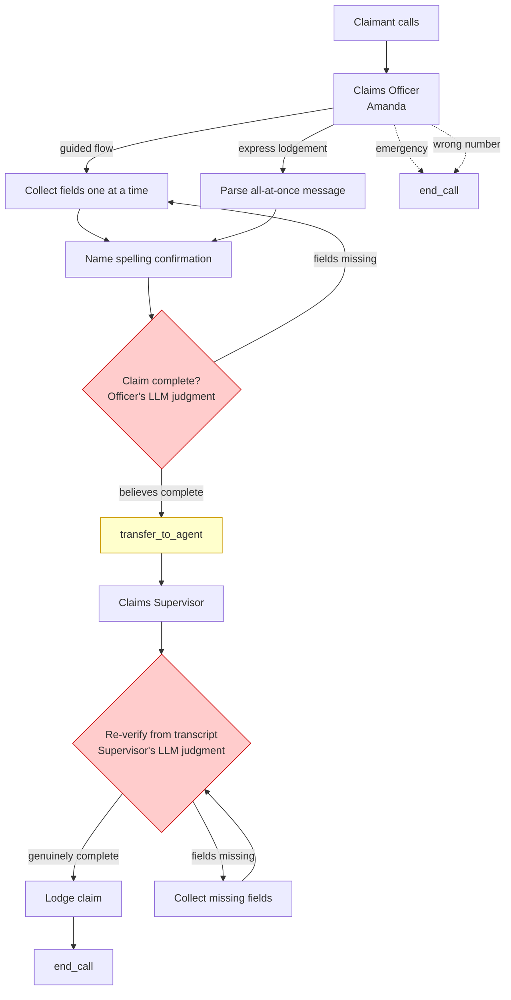

# ElevenLabs Platform Evaluation for FNOL — Structural Gaps and GCP Comparison

## Problem

We built a prototype First Notice of Loss (FNOL) insurance claims lodgement agent on the ElevenLabs Conversational AI platform for CGU (Australian insurer). The agent reached live production conversations. Four structural failure modes emerged that are inherent to the platform's LLM-orchestrated architecture, not implementation bugs:

1. **Non-deterministic slot filling.** The LLM tracks collected fields in its context window. In multi-turn calls it forgets, re-asks, or skips required fields. Prompt engineering tightens the distribution but doesn't close the gap.

2. **LLM-orchestrated control flow is unreliable.** The officer's `transfer_to_agent` to the Supervisor is LLM-triggered. The officer can hallucinate completeness and transfer early. A workflow-node graph was attempted first (ADR 0002) but LLM-conditioned edges never transitioned reliably. The current `transfer_to_agent` mechanism has the same class of failure: in the most recent production run, 0 of 4 officer calls reached the Supervisor — the officer called `end_call` itself after collecting fields.

3. **No defense is airtight.** The completeness guardrail (custom blocking guardrail on both agents) is the only mechanical check in the stack. It catches a response declaring lodgement when fields are genuinely absent from the transcript. But it fires *after* the LLM has generated the response, so it's a retry gate, not a prevention mechanism. The officer's self-check, prompt instructions, and the Supervisor's re-read are all LLM-judgment layers — each can be wrong, and in practice they were.

4. **Prompt engineering is the only lever.** ElevenLabs has no `before_model_callback`, no structured slot state, no tool visibility control driven by dependencies, and no deterministic task-firing mechanism. Every behavior — asking the next question, validating input, firing a backend call, confirming completeness — is a prompt engineering problem. The platform provides guardrails as a safety net, but guardrails are reactionary (block + retry), not structural.

This ADR compares the ElevenLabs approach to the GCP CXAS SCRAPI Slot Filling DAG Framework, which was evaluated as the primary alternative.

## Decision

We built on ElevenLabs to answer the question: **can a platform where the LLM orchestrates the entire conversation graph deliver a production-grade structured data collection agent?**

The answer, after reaching production, is: **not without external state infrastructure that the platform does not provide.** The prototype works for demonstration and simple paths but is not reliable enough for insurance claims lodgement where missed or hallucinated fields have compliance and operational consequences.

## Architecture We Built



The red nodes are LLM-judgment points. Both were observed to fail in production.

### Defense Layers (Defense in Depth by Necessity)

| Layer | Mechanism | Observed Reliability |
|-------|-----------|---------------------|
| 1. Officer self-check | Prompt: "silently check all fields are collected" | Unreliable — hallucinates completeness |
| 2. Prompt instruction | "Transfer, never end_call for completed claims" | Ignored — officer called end_call after transfer |
| 3. Supervisor re-read | Independent LLM reads transcript | Wrong in test harness — another LLM |
| 4. Completeness guardrail | Blocking custom guardrail on both agents | **Only mechanical check** — reactionary, not preventive |

The fact that four layers exist is itself a finding: no single layer is reliable enough alone.

## Production Gaps

### Gap 1: No Structured State

ElevenLabs agents have no server-side state primitive. The LLM's context window IS the state. For an FNOL call collecting 8+ fields over 15+ turns, this means:

- Fields can be forgotten (context window attention decay)
- There is no `sm['filled']` dict to query in code
- You can't log "what was collected so far" without scraping the transcript
- Mid-call hang-up recovery (PRD story 24: fire webhook with partial data) requires the LLM to have correctly tracked every field — it can't

**GCP equivalent:** `context.state['sm']` — a persistent dict with `filled`, `pending`, `deferred`, `task_results`. Deterministic. Survives turns. Queryable in callbacks.

### Gap 2: No Callback Preemption

ElevenLabs has no mechanism to bypass the LLM and deliver a system-generated response directly. Every turn goes through the LLM. This means:

- Validation errors (e.g., invalid policy number format) are delivered by the LLM, which may paraphrase or soften the error message
- Task results (e.g., "Policy lookup returned: policy active, excess $500") are relayed by the LLM, which may summarize or omit details
- You cannot force a verbatim legal disclosure without relying on prompt adherence
- The officer called `end_call` after a successful transfer because the LLM kept generating after the tool call — there is no "after tool X, stop" mechanism

**GCP equivalent:** `before_model_callback` returns `LlmResponse.from_parts()` — the LLM is skipped entirely for task results, validation errors, readback transitions, steer-back, and escalation. Five preemption triggers, all deterministic.

### Gap 3: LLM-Orchestrated Task Firing

In ElevenLabs, the LLM decides when to call a tool. For backend operations like policy lookup or claim registration:

- The LLM may call `lodge_claim` before all inputs are ready (premature task firing)
- The LLM may forget to call it at all
- There is no "task cascade" — if A's output should trigger B, the LLM must be prompted to do both sequentially
- `dispatch_tool` workflow nodes exist but don't solve this — they still rely on the LLM having reached the right node

**GCP equivalent:** Tasks fire automatically when all `inputs` are in `filled`. The engine evaluates the DAG every turn. Task cascading (A fills slot → B fires immediately → C fires immediately) happens in a single engine pass with zero user turns. The LLM is never asked "should I call the booking API now?"

### Gap 4: No Dependency-Driven Tool Visibility

ElevenLabs scopes tools per workflow node via `additional_tool_ids`, but within a node, all tools are visible. The LLM can call `set_injury_details` before `claim_type` is known because there's no dependency-driven tool hiding.

**GCP equivalent:** Setter tools are hidden from the LLM until their dependency slots are filled. The LLM structurally cannot call `set_selected_time` before `available_times` is filled. This is enforced by the framework, not the prompt.

### Gap 5: No Retry/Validation Framework

Validation and retry logic must be implemented in webhook tool code and prompt instructions. There is no platform-level retry counter, no `max_retries` config, no automatic escalation on exhaustion.

**GCP equivalent:** Slot-level validation with `max_retries`, `errors` map (error_code → message), and `on_exhaust` (escalation action). Task-level failure handling with `retry_say`, `clear_slots`, and `on_exhaust`. All config-driven, all deterministic.

### Gap 6: CLI Tool Dropping

The ElevenLabs CLI (`0.5.4` and `0.5.5`) silently drops certain tool entries — inline webhook definitions and `transfer_to_agent` — from push requests, reporting success while delivering incomplete config to the platform. We added `scripts/verify-live-tools.py` to CI specifically to catch this. A direct API PATCH works correctly, confirming the bug is in CLI serialization.

## Structured Comparison

| Capability | ElevenLabs (what we used) | GCP CXAS Slot Filling | FNOL Impact |
|-----------|--------------------------|----------------------|-------------|
| **State management** | LLM context window | `sm` dict in `context.state` — deterministic | Critical: 8+ fields over 15+ turns |
| **Question ordering** | Prompt-based ("ask one at a time") | DAG evaluation — `_next_question()` walks ordered slot list | Critical: wrong order confuses claimants |
| **Multi-slot extraction** | Prompt-based ("call ALL setters in one response") | Framework + tool visibility — enforced | Important: express lodgement mode |
| **Validation** | Prompt-based + webhook tool code | Config-driven: error codes → messages, retry caps, escalation | Critical: policy numbers, dates |
| **Task firing** | LLM decides | Auto-fires when inputs ready — guaranteed | Critical: policy lookup, claim registration |
| **Task cascading** | Not supported | Engine fires A→B→C in one pass | Important: lookup → fraud check → register |
| **Tool visibility** | Per-node scoping only | Per-dependency hiding — LLM can't call hidden tools | Critical: prevents premature/invalid tool calls |
| **LLM preemption** | None — LLM always generates | 5 deterministic triggers | Critical: verbatim disclosures, error messages |
| **Readback/confirmation** | Prompt-based | Built-in: `requires_readback`, deferred groups, auto-confirm | Important: name spelling, claim summary |
| **Conditional slots** | Workflow branches + prompt | Lambda conditions evaluated every turn, auto-clearing | Important: injury details only for auto claims |
| **Steer-back (off-topic)** | Prompt-based | 3-tier: soft → hard → escalate, counter-based | Important: distressed callers ramble |
| **Retry logic** | Manual in webhook tools | `_retries` dict, `max_retries` config, `on_exhaust` | Critical: bad policy numbers, invalid dates |
| **Guardrails** | Strong: layered + custom blocking rules | Prompt-based only | ElevenLabs advantage |
| **Voice quality** | Excellent (ElevenLabs TTS) | GCP TTS (serviceable) | ElevenLabs advantage |
| **Embedding/widget** | First-class: web widget, React hooks | GCP-native | ElevenLabs advantage |
| **Visual workflow editor** | Dashboard graph editor | None (code-only DAG config) | ElevenLabs advantage |
| **Per-node LLM/voice config** | Yes — different model/voice per phase | No | Nice-to-have |

## The Fundamental Tradeoff

```
ElevenLabs:  LLM IS the orchestrator → flexible, natural conversations
             but unreliable for structured data collection

GCP:         Python IS the orchestrator → deterministic, auditable
             but the LLM is reduced to a language interface
```

For FNOL, the scale tips toward GCP because:

1. **Correctness dominates user experience.** A warm, natural conversation that misses the claimant's policy number is worse than a slightly rigid conversation that gets every field right.
2. **Compliance requires audit trails.** You must be able to prove what was collected, when, and by what validation. A Python dict is auditable; an LLM context window is not.
3. **The failure modes compound.** An LLM that's 95% reliable at each of 8 fields gives $(0.95)^8 \approx 66\%$ chance of a perfectly complete claim. The four-layer defense is a symptom of this math, not a solution.

## Recommendation

For a production FNOL agent, **use GCP CXAS with the Slot Filling DAG Framework.** The deterministic state machine eliminates the four structural gaps we hit on ElevenLabs. The tradeoff is less conversational flexibility and no visual workflow editor, but for structured data collection in a regulated industry, that's the right trade.

ElevenLabs remains a strong choice for:

- Conversational agents where correctness is subjective (sales, support triage, FAQ)
- Rapid prototyping before committing to infrastructure
- Use cases where voice quality or widget embedding is the primary differentiator
- Agents where the LLM IS the product (creative, coaching, companionship)

But for "collect these 12 fields, validate each, call these 3 backends in order, and never drop data" — that's a state machine problem, not a conversation problem. ElevenLabs asks the LLM to be both.

## Consequences

- This repo serves as a documented evaluation artifact. A future README will reference this ADR and summarize findings for teams evaluating the same decision.
- The prototype code (agent configs, CI/CD, test suite) is preserved for reference but not intended for production deployment.
- If CGU proceeds with ElevenLabs for FNOL, the minimum viable addition is an external state service (see `slot-filling-elevenlabs-analysis.md`, Option C) that manages the `sm` dict and evaluates the DAG server-side — effectively porting the GCP pattern onto ElevenLabs infrastructure.
- If CGU proceeds with GCP, the domain model (CONTEXT.md), test scenarios, and PRD from this repo transfer directly — the slot definitions and validation rules are platform-agnostic.

## References

- [ADR 0001: New Claims Lodgement Agent](./0001-new-claims-lodgement-agent.md)
- [ADR 0002: Claims Supervisor as Separate Agent](./0002-claims-supervisor-as-separate-agent.md)
- [ADR 0003: Officer End-Call Restriction](./0003-officer-end-call-restriction.md)
- [PRD: CGU Claims Lodgement Agent](../prd/001-claims-lodgement-agent.md)
- [Slot Filling on ElevenLabs — Architecture Analysis](../../slot-filling-elevenlabs-analysis.md)
- [GCP CXAS Slot Filling DAG Framework](https://googlecloudplatform.github.io/cxas-scrapi/stable/guides/slot-filling/)
- [ElevenLabs Agent Workflows](https://elevenlabs.io/docs/eleven-agents/customization/agent-workflows)
